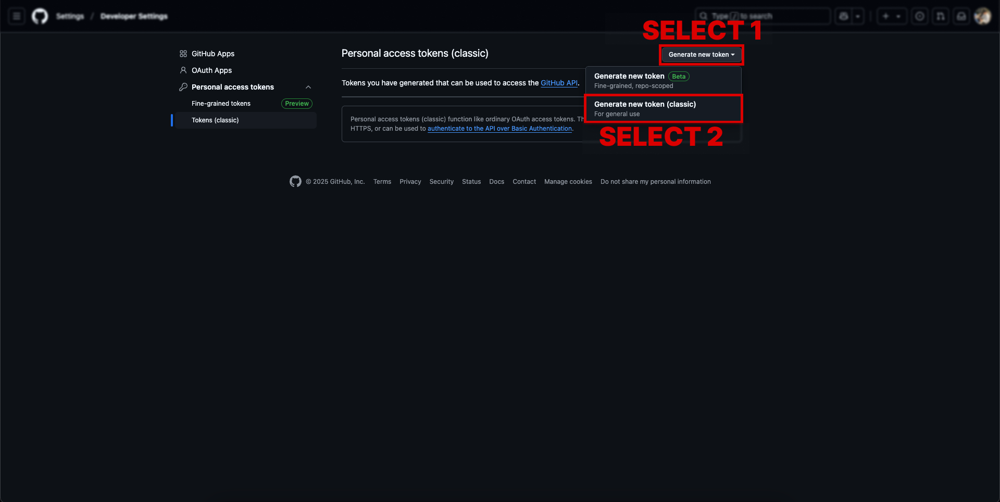
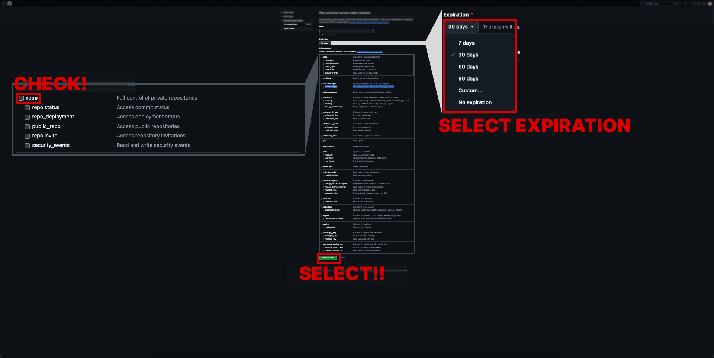
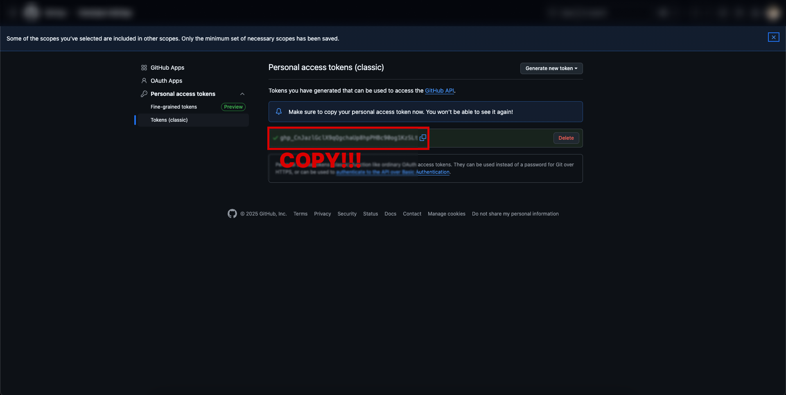

# GitHub Personal Access Token 발급 가이드

## 1. GitHub 설정 페이지 접속

1. GitHub.com에 로그인
2. 우측 상단의 프로필 아이콘 클릭
3. Settings 메뉴 선택

## 2. Developer settings 접속

1. 좌측 하단의 "Developer settings" 클릭

## 3. 새 토큰 생성

1. "Personal access tokens" 선택
2. "Tokens (classic)" 선택
3. "Generate new token" 버튼 클릭
4. "Generate new token (classic)" 선택

## 4. 토큰 설정

1. Note: 토큰의 용도를 설명하는 메모 입력 (예: "PR Creation Token")
2. Expiration: 토큰 만료 기간 선택 (권장: 90일 / 만료될 경우 재발급 받아야 합니다.)
3. Select scopes:
   - `repo` 권한 체크 (모든 repository 권한)

## 5. 토큰 저장

1. "Generate token" 버튼 클릭
2. 생성된 토큰을 안전한 곳에 복사하여 저장
   - ⚠️ 주의: 토큰은 생성 직후에만 확인 가능합니다!
