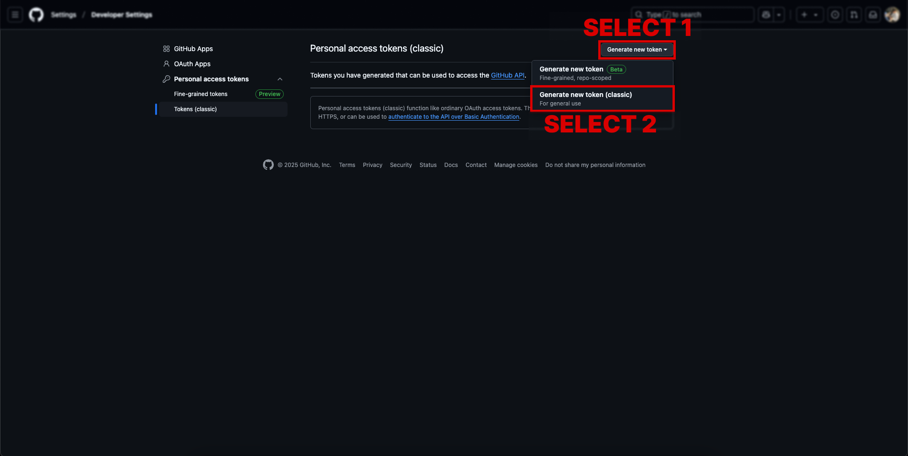
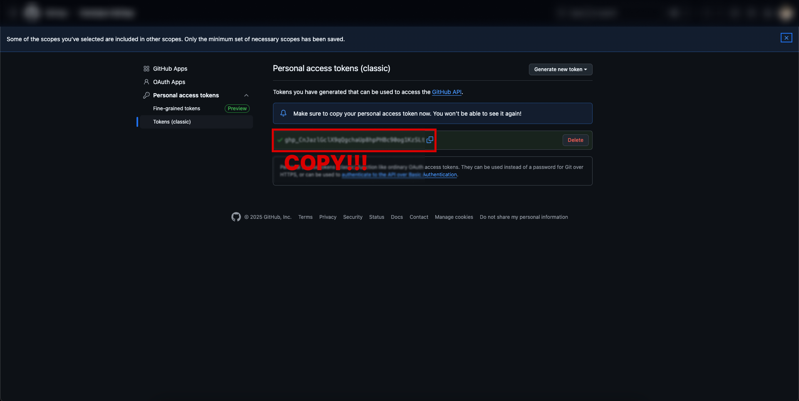

# GitHub Personal Access Token Guide

## 1. Access GitHub Settings

1. Login to GitHub.com
2. Click profile icon in top right
3. Select Settings menu

## 2. Access Developer settings

1. Click "Developer settings" at the bottom left

## 3. Generate New Token

1. Select "Personal access tokens"
2. Select "Tokens (classic)"
3. Click "Generate new token"
4. Select "Generate new token (classic)"

## 4. Token Settings

1. Note: Enter a description for the token (e.g., "PR Creation Token")
2. Expiration: Select token expiration period (Recommended: 90 days / You'll need to regenerate when expired)
3. Select scopes:
   - Check `repo` permission (Full repository access)

## 5. Save Token

1. Click "Generate token" button
2. Copy and save the generated token in a secure location
   - ⚠️ Warning: Token can only be viewed immediately after creation!
